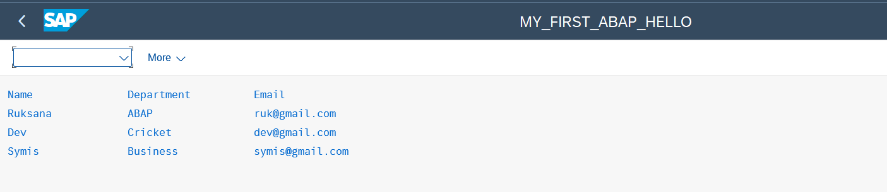
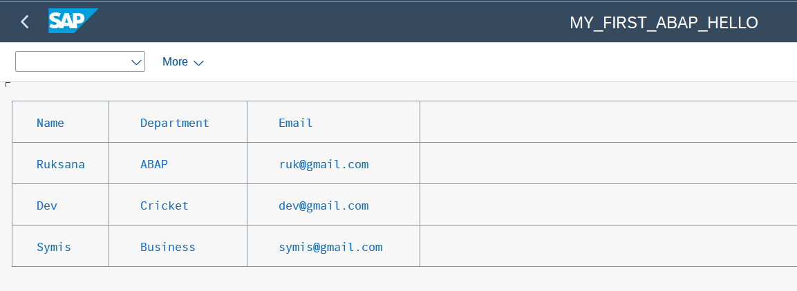
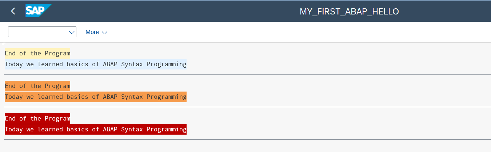
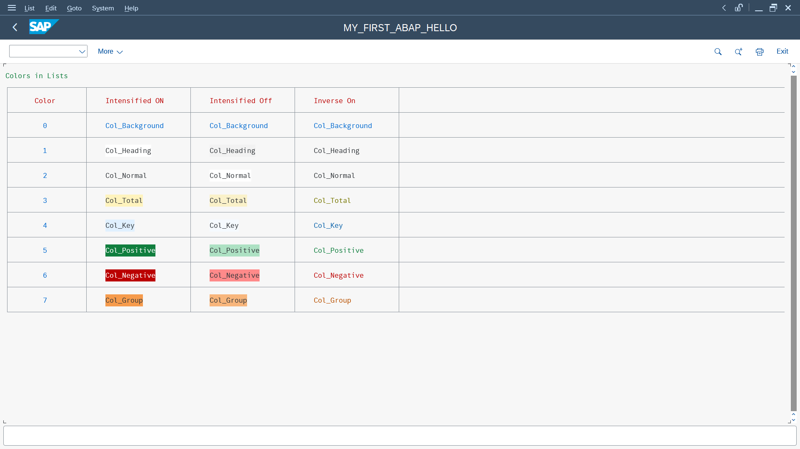

# 💙 Chapter 02 – My First ABAP Program

## 📖 Introduction

This chapter marks my first step into ABAP programming.

After building a foundation in SAP concepts, I started writing my first ABAP reports and learned how to display, organize, and format output using standard ABAP statements.

---

## 🎯 In This Chapter

During this chapter, I learned how to:

- Create my first ABAP report
- Understand the basic structure of an ABAP program
- Display output using the `WRITE` statement
- Organize report output using line breaks and column positions
- Build table-like reports using `ULINE` and `SY-VLINE`
- Format report output using colors, `INTENSIFIED`, and `INVERSE`
- Apply these concepts by creating my own ABAP color reference table

---

## 💻 Programs Created

| Program | Description |
|---------|-------------|
| `01_first_abap_program.abap` | My first ABAP program using the `WRITE` statement. |
| `02_employee_report.abap` | Displays employee details in a simple report. |
| `03_table_formatting.abap` | Demonstrates table formatting using `ULINE` and `SY-VLINE`. |
| `04_colored_output.abap` | Demonstrates text colors and formatting options. |
| `05_color_reference_table.abap` | A self-practice program that demonstrates all standard ABAP list colors using `COLOR`, `INTENSIFIED`, and `INVERSE`. |

---

## ⭐ Key Takeaway

This chapter helped me transition from learning SAP concepts to writing actual ABAP programs.

By the end of this chapter, I was comfortable creating simple reports, formatting output, and combining multiple ABAP statements to produce structured and readable reports.

One of the highlights was building a complete color reference table on my own using the concepts I had learned, reinforcing my understanding of ABAP list formatting.

---

## 📂 Source Code

All ABAP source files for this chapter are available in the **`src`** folder.

---

## 📷 Sample Outputs

### Employee Report

---

### Table Formatting

---

### Colored Output

---

### Color Reference Table (Self Practice)

