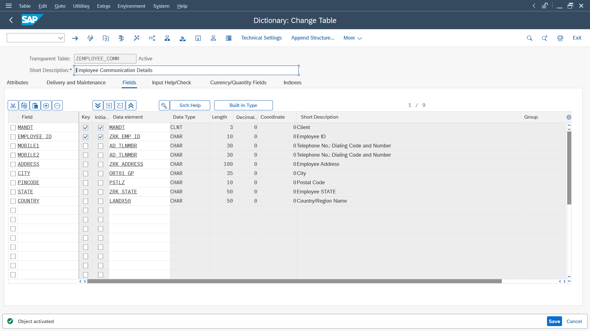
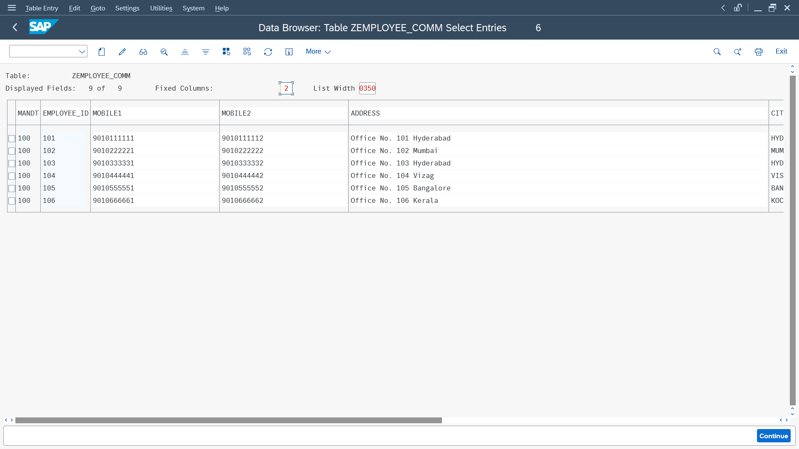
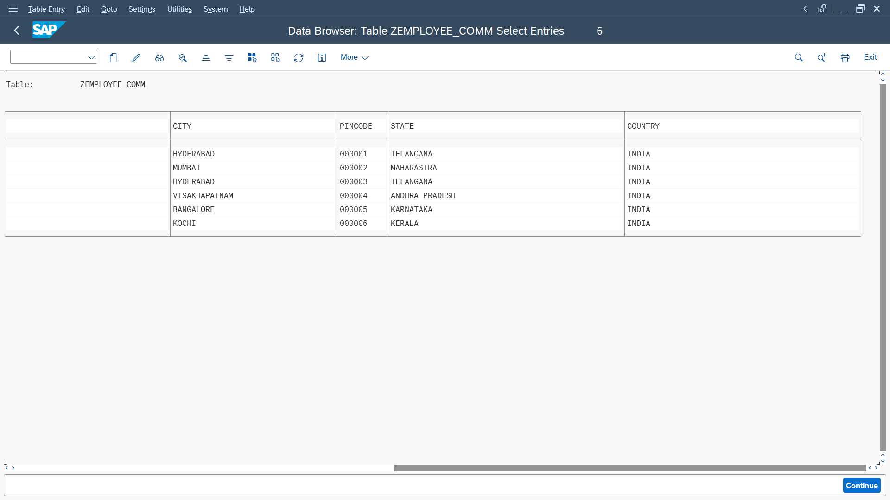
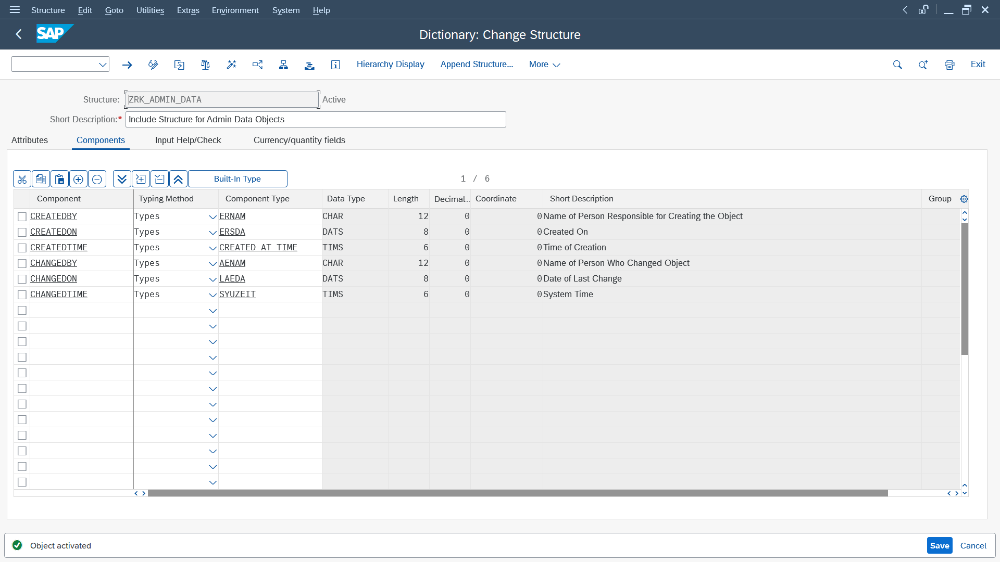
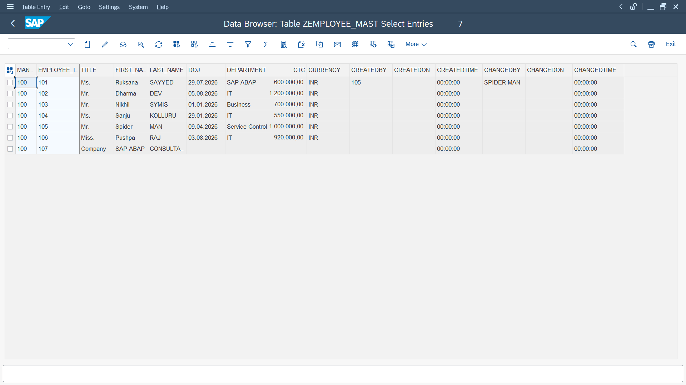
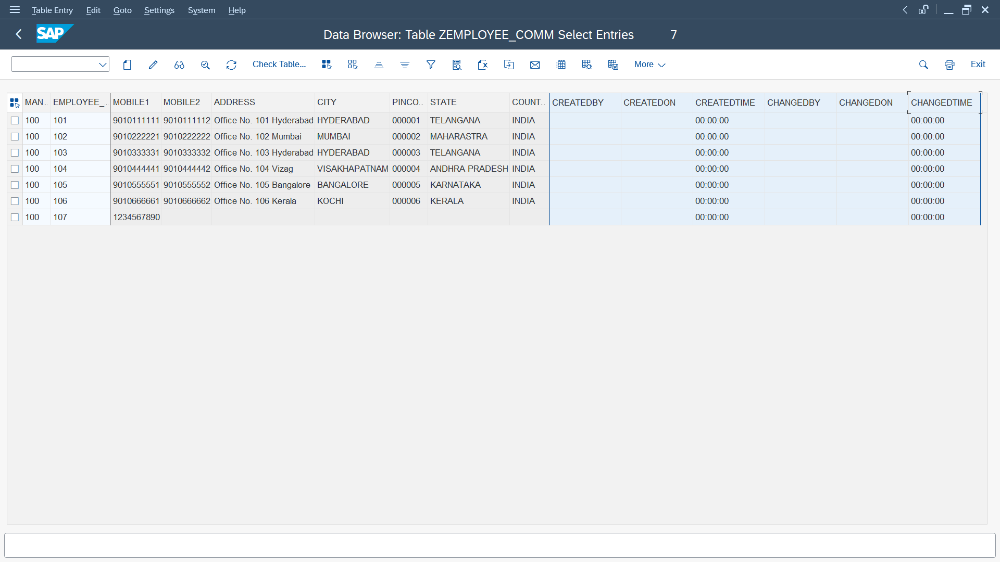
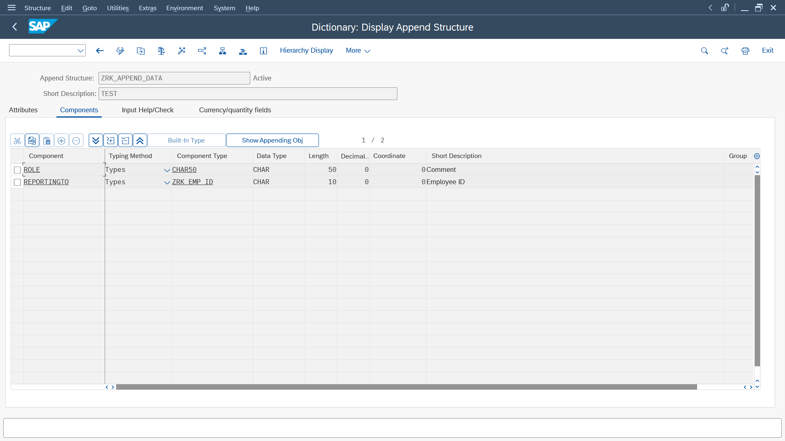
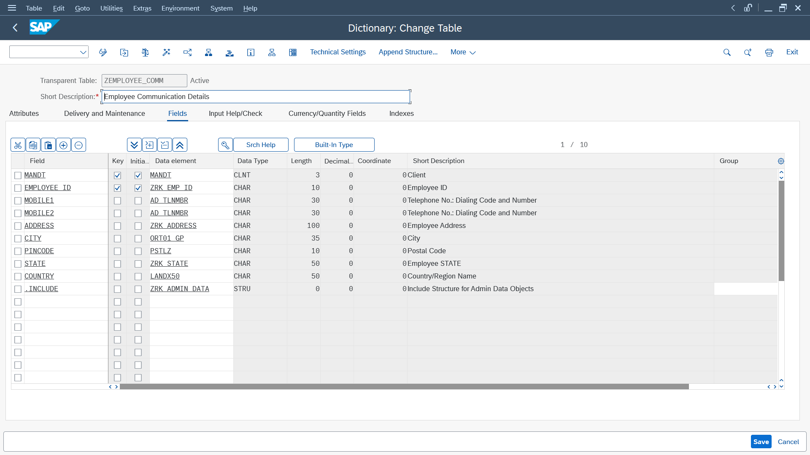
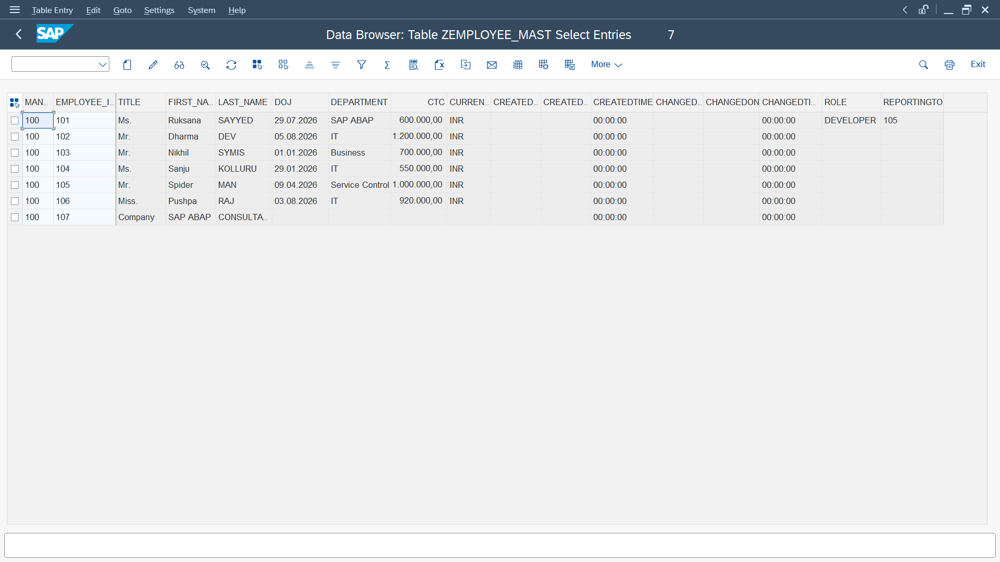

# 📘 Chapter 03 — ABAP Data Dictionary (DDIC)

> Building enterprise database objects one relationship at a time.

---

## 🌱 Chapter Goal

This chapter marks my transition from writing ABAP programs to understanding how SAP stores and manages business data.

Instead of jumping directly into application logic, I'm learning the foundation that ABAP applications rely on:

- Domains
- Data Elements
- Transparent Tables
- Structures
- Primary Keys
- Foreign Keys
- Enterprise Data Modeling

---

# 🏗️ Project

## Employee Master Database

In this chapter, I designed a small employee database using the SAP Data Dictionary (DDIC).

Rather than storing all employee information in a single table, I separated employee master information from communication details.

This provides a more modular database design and demonstrates how SAP dictionary objects can be combined to model business data.

### Current Database Structure

```text
Employee Master System

ZEMPLOYEE_MASTER
        │
        └──────────────┐
                       │
                       ▼
                ZEMPLOYEE_COMM
```

The database consists of:

- `ZEMPLOYEE_MASTER` — Employee master information
- `ZEMPLOYEE_COMM` — Employee communication information

---

# 📦 Objects Created

## 1. ZEMPLOYEE_MASTER

The employee master table stores the primary business information for each employee.

### Main Fields

- Employee ID
- Title
- First Name
- Last Name
- Date of Joining
- Department
- CTC
- Currency

The table uses `MANDT` and `EMPLOYEE_ID` as key fields.

### Table Definition


### Data Preview


---

## 2. ZEMPLOYEE_COMM

The employee communication table stores contact and address information separately from the employee master data.

### Main Fields

- Employee ID
- Mobile 1
- Mobile 2
- Address
- City
- Pincode
- State
- Country

### Table Definition



### Data Preview





---

# 🧩 Structures

To avoid repeatedly defining common technical fields, I created reusable structures in the ABAP Data Dictionary.

---

## INCLUDE Structure — ZRK_ADMIN_DATA

`ZRK_ADMIN_DATA` is an **Include Structure** containing common administrative and audit fields.

It contains:

- `CREATEDBY`
- `CREATEDON`
- `CREATEDTIME`
- `CHANGEDBY`
- `CHANGEDON`
- `CHANGEDTIME`

These fields provide a consistent way to track when an object was created or changed and by whom.

### Structure Definition



### Included in Employee Master Table



### Included in Employee Communication Table



---

## APPEND Structure — ZRK_APPEND_DATA

`ZRK_APPEND_DATA` is an **Append Structure** used to extend the employee master table with additional business fields.

It contains:

- `ROLE`
- `REPORTINGTO`

### Append Structure Definition



### Appended to Employee Master Table



### Result in Table Data



---

# 🧠 INCLUDE vs APPEND Structure

This exercise helped me understand the practical difference between Include and Append Structures in SAP.

| Feature | INCLUDE Structure | APPEND Structure |
|---|---|---|
| Purpose | Reuse a group of fields | Extend an existing table or structure |
| Reusability | Can be included in multiple objects | Designed to extend a specific object |
| Used in this project | Master + Communication tables | Master table only |
| Example | `ZRK_ADMIN_DATA` | `ZRK_APPEND_DATA` |

### In This Project

```text
ZRK_ADMIN_DATA
       │
       ├──────────────► ZEMPLOYEE_MASTER
       │
       └──────────────► ZEMPLOYEE_COMM


ZRK_APPEND_DATA
       │
       └──────────────► ZEMPLOYEE_MASTER
```

This demonstrates how SAP DDIC structures can be used to keep table definitions modular and maintainable.

---

# 📚 Concepts Learned

Through this chapter, I practiced:

# 📚 Concepts Learned

✔ Domains

✔ Data Elements

✔ Transparent Tables

✔ Structures

✔ Include Structures

✔ Append Structures

✔ Primary Keys

✔ Client-dependent Tables

✔ Initial Values

✔ Data Browser (SE16)

✔ Enterprise Data Modeling

---

# 💡 What I Learned

Some of the biggest lessons from this chapter weren't just about creating tables. They were about understanding **why** SAP uses reusable dictionary objects and structured data models.

I learned that:

- Data Elements provide reusable and consistent field definitions.
- Domains define technical characteristics such as data type and length.
- Primary Keys uniquely identify database records.
- Transparent Tables store persistent business data in the database.
- Separating business information into logical tables improves maintainability.
- Include Structures allow common groups of fields to be reused across multiple objects.
- Append Structures provide a way to extend existing table definitions.
- Audit fields such as created-by and changed-by information are useful for tracking data changes.
- Good database design makes future ABAP application development easier.

---

# 🔗 Data Modeling

The database is designed around the idea of separating employee master information from communication information.

```text
                 Employee
                    │
          ┌─────────┴─────────┐
          │                   │
          ▼                   ▼
 ZEMPLOYEE_MASTER       ZEMPLOYEE_COMM
          │                   │
          │                   │
   Employee Details     Contact Details
```

The employee identifier provides the connection between the two business objects.

This structure provides a foundation for adding additional relationships and validation rules as the database evolves.

---

# 📷 Screenshots

The project screenshots are organized by topic:

```text
screenshots/
│
├── foreign-keys/
│
├── structures/
│   ├── 01-include-structure-definition.png
│   ├── 02-include-structure-in-master-table.png
│   ├── 03-include-structure-in-communication-table.png
│   ├── 04-append-structure-definition.png
│   ├── 05-append-structure-in-master-table.png
│   └── 06-append-structure-data-preview.png
│
└── table-creation/
```

---

# 🚀 Next Steps

The next part of this learning journey will focus on strengthening the relationships between the database objects and understanding how SAP validates related data.

Topics include:

- Foreign Keys
- Check Tables
- Search Helps
- Table Relationships
- Further Data Dictionary validation

These concepts will build on the tables and structures created in this chapter and move the database model closer to a real-world SAP application design.

---

🌱 Every chapter builds another piece of the system.