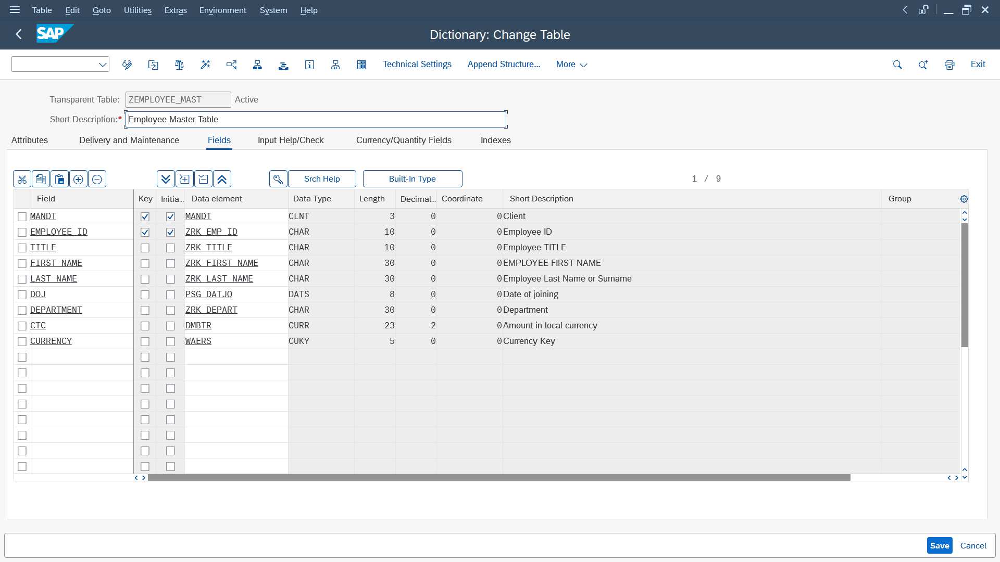
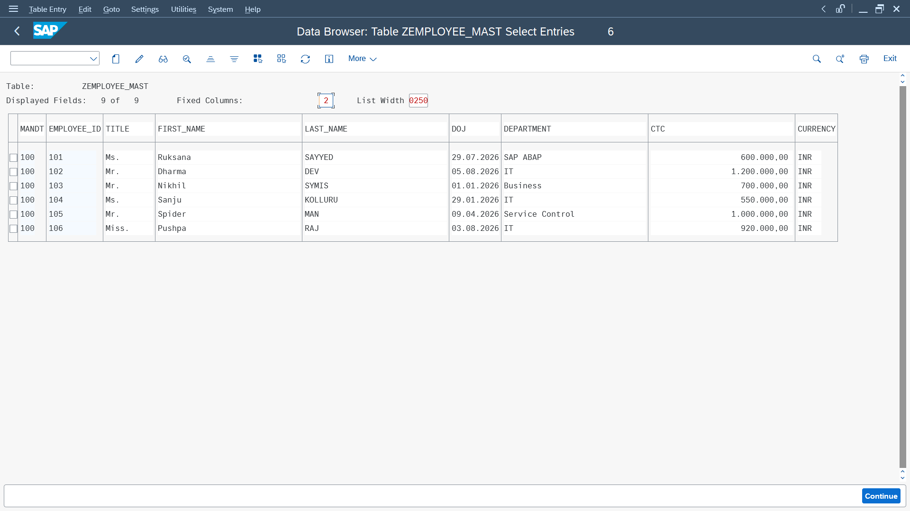

# 📘 Chapter 03 — ABAP Data Dictionary (DDIC)

> ### 🏗️ Building My First SAP Database Objects
>
> *Learning how SAP defines, validates, and stores business data using reusable Data Dictionary objects.*

---

## 🌱 Chapter Goal

This chapter marks my transition from writing ABAP programs to understanding **how SAP stores and manages business data**.

Instead of focusing only on programming, I explored the metadata layer that defines database objects in SAP. This chapter helped me understand how tables, fields, data elements, and domains work together to create reusable and consistent business data structures.

---

## 🧠 What I Explored

Throughout this chapter, I learned how SAP organizes data using the ABAP Data Dictionary (DDIC).

Some of the concepts I explored include:

- Understanding the purpose of the ABAP Data Dictionary
- Standard SAP tables vs Custom tables
- Primary Keys and Composite Keys
- Clients (`MANDT`)
- Transparent Tables
- Fields and Database Structure
- Data Elements
- Domains
- Built-in Data Types
- Field Labels
- Technical Settings
- Delivery Class
- Buffering
- Search Helps
- Value Ranges
- Table Activation
- Viewing and maintaining data using **SE16N**

---

## 🛠️ What I Built

To apply these concepts, I designed my first custom SAP database table.

### 📂 Project
**Employee Master Table (`ZEMPLOYEE_MAST`)**

The table stores basic employee information while applying proper DDIC design principles.

Fields include:

- Employee ID
- Title
- First Name
- Last Name
- Date of Joining
- Department
- Salary (Currency Amount)
- Currency Key

While building this table, I also created and worked with:

- Custom Data Elements
- Custom Domains
- Search Helps
- Currency & Quantity References
- Technical Settings
- Primary Keys

---

## 📸 Project Snapshot

### 🏗️ Employee Master Table Design

Shows the final table structure including fields, keys, data elements, domains, and technical attributes.

---

### 📊 Employee Master Table Data

After activating the table, I inserted sample employee records and verified the data using SAP Data Browser.

---

## ✨ Biggest Takeaways

This chapter completely changed how I think about SAP development.

Before this, I saw a database table as simply rows and columns.

Now I understand that every field in SAP carries:

- **Business meaning** through a **Data Element**
- **Technical definition** through a **Domain**
- **Database behavior** through **Technical Settings**

I also learned why SAP separates business semantics from technical implementation, making applications more reusable, consistent, and easier to maintain.

Building my own custom table helped connect these concepts in a practical way.

---

## 🌱 Reflection

This chapter felt like building the foundation beneath every SAP application.

Instead of only writing ABAP code, I started understanding the architecture that supports enterprise data.

Creating my first custom DDIC objects made SAP feel much less like a black box and much more like a thoughtfully designed system.

Although this is only the beginning, I now have a much stronger understanding of how SAP models business data before any application logic is written.

---

> 📖 *This chapter is still in progress. Next, I'll continue exploring the ABAP Data Dictionary by designing additional custom database objects and expanding my understanding of enterprise data modeling.*
